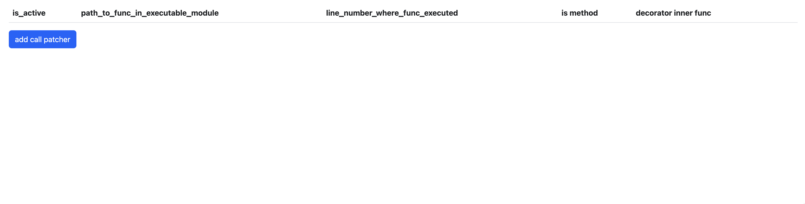

# FuncCallPatcherApi

Надстройка над [FuncCallPatcher](https://github.com/Rwwwrl/Func-call-patcher) для удобного патча в джанговых проектах через вебинтерфейс без перезагрузки сервера

### Setup

1. В INSTALLED_APPS добавить `"func_call_patcher_api"`
2. В TEMPLATES.DIRS добавить `os.path.join(BASE_DIR, 'templates')`
3. В MIDDLEWARE добавить `"func_call_patcher_api.middleware.FuncCallPatcherMiddleware"`
4. В urls.py добавить `url(r'^func_patcher_api/', include('func_call_patcher_api.urls')),`

Теперь при заходе на _/func_patcher_api/_ появится страница с добавлением патчей

Добавить новый патч можно нажав на кнопку "add call patcher".
